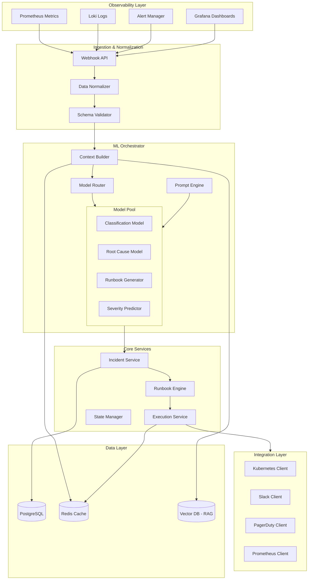
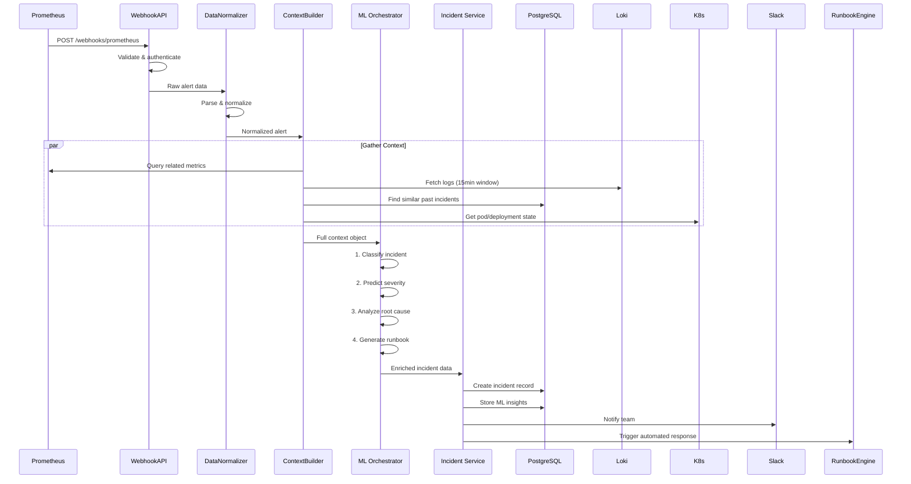
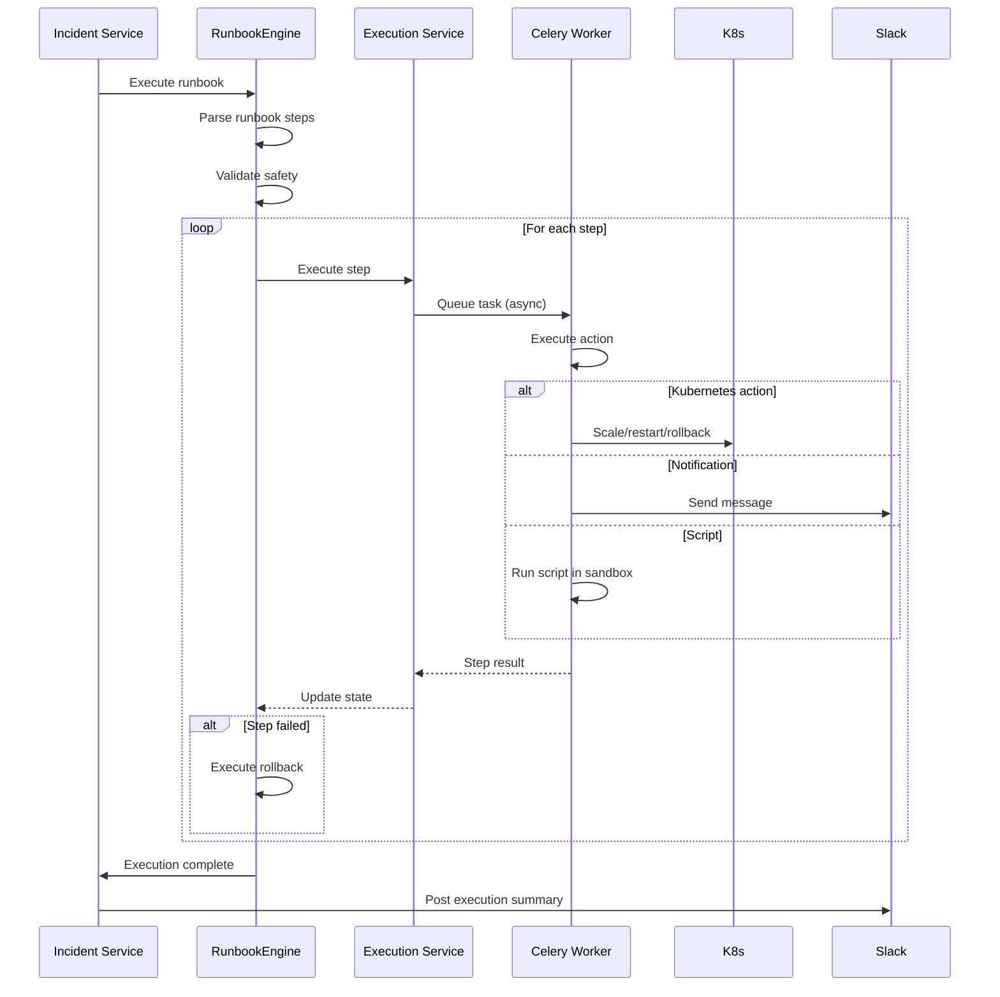

# System Architecture

## Overview

The Incident Response Automation platform is a comprehensive, ML-powered system designed to detect, analyze, and automatically respond to infrastructure incidents. It integrates deeply with observability tools (Prometheus, Loki, Grafana) and uses multiple AI/ML models to provide intelligent incident management from detection through resolution.

## Design Principles

### 1. **AI-First Architecture**
Every incident is enriched with ML-powered insights including classification, severity prediction, root cause analysis, and automated runbook generation.

### 2. **Modular & Extensible**
The system is built with clear separation of concerns, allowing easy addition of new integrations, models, and runbook actions.

### 3. **Safety & Validation**
All automated actions go through validation and risk assessment. High-risk operations require manual approval.

### 4. **Observable & Debuggable**
Every action, decision, and model inference is logged with full traceability for audit and debugging.

### 5. **Kubernetes-Native**
Designed to run on Kubernetes with native integration for pod operations, scaling, and incident response.

## High-Level Architecture



## Component Details

### 1. Observability Layer

**Purpose**: External monitoring and alerting systems that generate incident signals.

**Components**:
- **Prometheus**: Time-series metrics and alerting
- **Loki**: Log aggregation and querying
- **Grafana**: Dashboard visualization and snapshots
- **AlertManager**: Alert routing and grouping

**Integration**: Sends webhook notifications to our Ingestion Layer when alerts fire.

### 2. Ingestion & Normalization Layer

**Purpose**: Receive, validate, and normalize data from diverse sources into a unified schema.

#### 2.1 Webhook API
- **Technology**: FastAPI
- **Responsibilities**:
  - Receive webhooks from Prometheus, AlertManager, Loki
  - Authentication via API keys
  - Rate limiting and request validation
  - Route to appropriate handlers

**Endpoints**:
```
POST /webhooks/prometheus
POST /webhooks/alertmanager
POST /webhooks/loki
POST /webhooks/grafana
POST /webhooks/custom
```

#### 2.2 Data Normalizer
- **Purpose**: Transform diverse alert formats into unified internal schema
- **Responsibilities**:
  - Parse Prometheus alert format
  - Parse Loki log streams
  - Extract Grafana dashboard context
  - Standardize timestamps, labels, and metadata
  - Deduplicate alerts (fingerprinting)

#### 2.3 Schema Validator
- **Purpose**: Ensure data quality before ML processing
- **Responsibilities**:
  - Validate against Pydantic schemas
  - Enrich with default values
  - Flag missing critical fields
  - Log validation errors

### 3. ML Orchestrator

**Purpose**: The brain of the system - uses multiple AI/ML models to analyze incidents and generate responses.

#### 3.1 Context Builder
- **Purpose**: Aggregate all relevant data for ML model consumption
- **Data Sources**:
  - Current alert/incident data
  - Related logs from Loki (time window)
  - Relevant metrics from Prometheus
  - Grafana dashboard snapshots
  - Historical similar incidents (from Vector DB)
  - Current Kubernetes state
  
**Output**: Structured ML context object with all relevant information

#### 3.2 Model Router
- **Purpose**: Route tasks to appropriate ML models
- **Routing Logic**:
  - Task type (classification, root cause, runbook generation)
  - Model availability and health
  - Cost optimization (cheaper models for simple tasks)
  - Fallback chain (primary → secondary → tertiary)

#### 3.3 Prompt Engine
- **Purpose**: Generate optimized prompts for LLM models
- **Features**:
  - Template-based prompt generation
  - Dynamic context injection
  - Token optimization (stay within limits)
  - Few-shot examples from historical incidents
  - Chain-of-thought prompting for complex reasoning

#### 3.4 Model Pool

**Classification Model**
- **Purpose**: Categorize incident type and affected components
- **Model**: GPT-4-turbo or Claude-3-opus
- **Input**: Alert data, logs, metrics
- **Output**: 
  ```json
  {
    "category": "infrastructure",
    "subcategory": "compute",
    "affected_component": "api-gateway",
    "confidence": 0.95
  }
  ```

**Severity Predictor**
- **Purpose**: Predict incident severity and urgency
- **Model**: Ensemble (XGBoost + LLM)
- **Features**:
  - Alert severity label
  - Affected service criticality
  - Number of affected pods/users
  - Time of day (business hours = higher severity)
  - Historical incident patterns
- **Output**:
  ```json
  {
    "severity": "critical",
    "severity_score": 9.2,
    "confidence": 0.88,
    "reasoning": "Production API service affected, 50% error rate"
  }
  ```

**Root Cause Model**
- **Purpose**: Analyze symptoms and identify probable root causes
- **Model**: Claude-3-opus with RAG
- **RAG Database**: Vector embeddings of past incidents and solutions
- **Input**: Full context (alerts, logs, metrics, K8s state)
- **Output**:
  ```json
  {
    "probable_causes": [
      {
        "cause": "Database connection pool exhaustion",
        "confidence": 0.85,
        "evidence": ["Connection timeout errors in logs", "DB pool metrics at max"]
      },
      {
        "cause": "Network latency to DB",
        "confidence": 0.60,
        "evidence": ["Increased latency in metrics"]
      }
    ],
    "recommended_investigation": ["Check DB connection count", "Review network metrics"]
  }
  ```

**Runbook Generator**
- **Purpose**: Generate automated response runbooks
- **Model**: GPT-4-turbo with runbook template library
- **Input**: Incident classification, root cause analysis, system state
- **Output**: Executable runbook (YAML/JSON)
- **Features**:
  - Safety validation (no destructive operations without approval)
  - Risk scoring for each step
  - Rollback procedures
  - Success criteria

### 4. Core Services

#### 4.1 Incident Service
- **Purpose**: Manage incident lifecycle
- **Responsibilities**:
  - Create incidents from alerts
  - Track incident status (new → investigating → resolved)
  - Manage incident timeline
  - Store ML insights
  - Calculate SLA metrics (MTTR, MTTA)
  - Incident correlation and grouping
  - Auto-resolution when alerts clear

**State Machine**:
```
new → investigating → resolved
  ↓         ↓
escalated → escalated
```

#### 4.2 Runbook Engine
- **Purpose**: Execute automated response runbooks
- **Features**:
  - Step-by-step execution
  - Conditional logic
  - Parallel execution
  - Retry with exponential backoff
  - Timeout handling
  - Manual approval steps
  - Rollback on failure

**Supported Step Types**:
1. `http_request` - Call external APIs
2. `kubernetes_action` - Scale, restart, rollback pods
3. `script_execution` - Run Python/Bash scripts
4. `notification` - Send alerts (Slack, PagerDuty)
5. `wait` - Delay execution
6. `conditional` - If/else branching
7. `parallel` - Execute multiple steps concurrently
8. `query_metrics` - Query Prometheus
9. `query_logs` - Query Loki
10. `manual_approval` - Wait for human approval

#### 4.3 Execution Service
- **Purpose**: Execute individual runbook steps
- **Technology**: Celery workers for async execution
- **Responsibilities**:
  - Execute steps safely in isolated environment
  - Capture execution logs
  - Monitor step success/failure
  - Handle timeouts and retries
  - Rollback on failure
  - Update execution state in real-time

#### 4.4 State Manager
- **Purpose**: Track execution state and enable resumption
- **Storage**: Redis for fast state access
- **Features**:
  - Store current execution state
  - Enable pause/resume
  - Handle crash recovery
  - Distributed locking for concurrent executions

### 5. Integration Layer

**Purpose**: Connect to external systems for notifications and actions.

#### 5.1 Kubernetes Client
- **Operations**:
  - Scale deployments
  - Restart pods
  - Rollback deployments
  - Get pod logs
  - Get pod events
  - Update ConfigMaps
  - Cordon/uncordon nodes
- **Authentication**: ServiceAccount with RBAC
- **Safety**: Read-only by default, write operations require validation

#### 5.2 Slack Client
- **Operations**:
  - Send incident notifications
  - Create incident threads
  - Update incident status
  - Request approvals via interactive buttons
  - Post resolution summaries
- **Features**: Rich formatting, @ mentions, reaction tracking

#### 5.3 PagerDuty Client
- **Operations**:
  - Create incidents
  - Escalate incidents
  - Resolve incidents
  - Sync status bidirectionally
- **Features**: Map severity to PagerDuty urgency

#### 5.4 Prometheus Client
- **Operations**:
  - Query metrics
  - Evaluate PromQL expressions
  - Check alert status
  - Silence alerts
- **Use Cases**: Validate resolution, gather context

### 6. Data Persistence Layer

#### 6.1 PostgreSQL
- **Purpose**: Primary data store
- **Schema**:
  - `incidents` - Incident records
  - `alerts` - Alert history
  - `runbooks` - Runbook definitions
  - `executions` - Execution history
  - `ml_insights` - Model predictions and reasoning
  - `audit_logs` - Full audit trail

#### 6.2 Redis
- **Purpose**: Caching and real-time state
- **Uses**:
  - Execution state cache
  - Rate limiting
  - Celery task queue
  - Real-time incident status
  - Deduplication cache

#### 6.3 Vector Database (Qdrant/Pinecone)
- **Purpose**: RAG for historical incident search
- **Data**: 
  - Embeddings of past incidents
  - Resolution steps that worked
  - Root cause analyses
- **Queries**: Find similar incidents for context

## Data Flow

### Incident Creation Flow



### Runbook Execution Flow



## Technology Stack

### Core Framework
- **Language**: Python 3.11+
- **Web Framework**: FastAPI
- **Async Runtime**: uvicorn + asyncio

### Data Layer
- **Primary Database**: PostgreSQL 15
- **ORM**: SQLAlchemy 2.0 (async)
- **Migrations**: Alembic
- **Cache**: Redis 7.0
- **Vector DB**: Qdrant or Pinecone

### ML/AI
- **LLM Providers**: OpenAI (GPT-4), Anthropic (Claude-3)
- **ML Models**: scikit-learn, XGBoost
- **Embeddings**: OpenAI text-embedding-3
- **Prompt Management**: LangChain or custom

### Task Processing
- **Task Queue**: Celery
- **Message Broker**: Redis
- **Workers**: Celery workers (separate process)

### Integrations
- **Kubernetes**: official kubernetes Python client
- **Prometheus**: prometheus-api-client
- **Loki**: logcli + HTTP API
- **Slack**: slack-sdk
- **PagerDuty**: pdpyras

### Observability
- **Metrics**: Prometheus client (expose /metrics)
- **Logging**: structlog (JSON logs)
- **Tracing**: OpenTelemetry (optional)

### Development
- **Testing**: pytest, pytest-asyncio, httpx
- **Linting**: ruff, black
- **Type Checking**: mypy
- **Pre-commit**: pre-commit hooks

### Deployment
- **Containers**: Docker
- **Orchestration**: Kubernetes
- **Config**: Pydantic Settings + env vars
- **Secrets**: Kubernetes Secrets

## Scalability Considerations

### Horizontal Scaling
- **API Servers**: Stateless, can scale horizontally
- **Celery Workers**: Scale workers based on queue depth
- **Database**: PostgreSQL with read replicas
- **Redis**: Redis Cluster for high availability

### Performance Optimization
- **Caching**: Redis cache for frequently accessed data
- **Connection Pooling**: Database connection pooling
- **Async I/O**: Non-blocking I/O for all external calls
- **Batch Processing**: Batch similar requests to ML models

### Rate Limiting
- **Webhook Ingestion**: Rate limit per source
- **ML API Calls**: Token bucket algorithm
- **Integration APIs**: Respect external rate limits

## Security Architecture

### Authentication & Authorization
- **Webhook Endpoints**: API key authentication
- **REST API**: JWT tokens
- **Service-to-Service**: Mutual TLS
- **Kubernetes**: ServiceAccount with RBAC

### Data Security
- **Secrets**: Stored in Kubernetes Secrets
- **API Keys**: Encrypted at rest
- **Sensitive Logs**: Redacted before storage
- **Database**: Encryption at rest

### Network Security
- **Ingress**: TLS termination at ingress
- **Internal**: Service mesh (optional)
- **Egress**: Firewall rules for external calls

### Audit & Compliance
- **Audit Logs**: All actions logged with user/service identity
- **Immutable Logs**: Append-only audit trail
- **Retention**: Configurable retention policies

## Disaster Recovery

### Backup Strategy
- **Database**: Daily full backup + continuous WAL archiving
- **Redis**: RDB snapshots + AOF
- **Configuration**: Version controlled in Git

### High Availability
- **API**: Multiple replicas with load balancing
- **Database**: Primary with streaming replication
- **Redis**: Redis Sentinel or Cluster
- **Workers**: Multiple workers across nodes

### Failure Scenarios

| Failure | Detection | Recovery |
|---------|-----------|----------|
| API pod crash | K8s liveness probe | Auto-restart by K8s |
| DB connection loss | Health check failure | Reconnect with exponential backoff |
| ML API timeout | Request timeout | Fallback to simpler model |
| Worker crash | Celery task timeout | Task retry by Celery |
| Redis failure | Connection error | Degrade gracefully, skip caching |
| Runbook execution failure | Step failure | Execute rollback steps |

## Monitoring & Observability

### Metrics (Prometheus)
```
# Incidents
incidents_created_total
incidents_resolved_total
incident_resolution_time_seconds

# ML
ml_inference_duration_seconds
ml_inference_cost_dollars
ml_model_errors_total

# Runbooks
runbook_execution_duration_seconds
runbook_step_failures_total
runbook_success_rate

# API
http_requests_total
http_request_duration_seconds
```

### Dashboards (Grafana)
1. **Incident Overview**: Active incidents, resolution rates
2. **ML Performance**: Model latency, accuracy, costs
3. **System Health**: API latency, error rates, queue depth
4. **Runbook Execution**: Success rates, execution times

### Alerting
- API error rate > 5%
- Incident resolution time > SLA
- ML model errors > threshold
- Worker queue depth > capacity
- Database connection pool exhausted

## Future Enhancements

### Phase 2 Features
- **Multi-tenancy**: Support multiple teams/environments
- **Custom ML Models**: Train on customer's historical data
- **Advanced Correlation**: Graph-based incident correlation
- **Predictive Alerts**: Predict incidents before they occur
- **Self-Healing**: Fully autonomous incident resolution

### Phase 3 Features
- **Web UI Dashboard**: React-based frontend
- **Mobile App**: iOS/Android incident management
- **Advanced Analytics**: Incident trend analysis
- **Cost Optimization**: ML-driven resource optimization
- **Compliance**: SOC2, ISO 27001 certifications

## Conclusion

This architecture provides a robust, scalable, and intelligent incident response platform. The ML-first approach enables automation of routine incidents while providing valuable insights for complex scenarios. The modular design allows for easy extension and customization to meet specific organizational needs.
