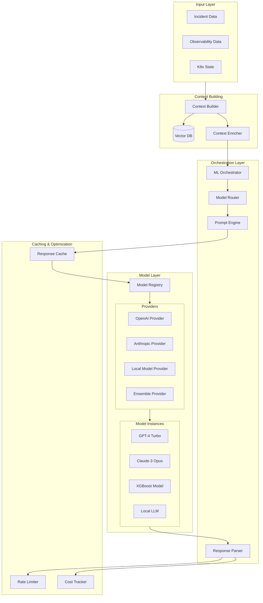

# ML Orchestrator Design

## Overview

The ML Orchestrator is the intelligence layer of the incident response platform. It coordinates multiple AI/ML models to analyze incidents, predict severity, identify root causes, and generate automated response plans. The design emphasizes flexibility, allowing different models to be used for different tasks while maintaining a consistent interface.

## Design Goals

1. **Multi-Model Support**: Use different models for different tasks (GPT-4, Claude, XGBoost, etc.)
2. **Provider Flexibility**: Easy to switch between providers (OpenAI, Anthropic, local models)
3. **Cost Optimization**: Route to cheaper models when appropriate
4. **Fault Tolerance**: Graceful fallbacks when models fail or timeout
5. **Observable**: Full logging and metrics for model performance
6. **Extensible**: Easy to add new models and tasks

## Architecture



## Core Components

### 1. Context Builder

**Purpose**: Aggregate all relevant data for ML model consumption.

**File**: `src/services/ml/context_builder.py`

```python
class ContextBuilder:
    """Builds comprehensive ML context from incident data"""
    
    async def build_context(
        self,
        alert: PrometheusAlert,
        task: MLTaskType,
        incident_id: Optional[str] = None
    ) -> MLContext:
        """
        Build full context for ML model
        
        Steps:
        1. Fetch logs from Loki (time window around alert)
        2. Query metrics from Prometheus
        3. Get Kubernetes state
        4. Find similar historical incidents (vector search)
        5. Aggregate into MLContext schema
        """
        
    async def _fetch_logs(self, labels: Dict, time_range: TimeRange) -> LokiLogsContext:
        """Fetch relevant logs from Loki"""
        
    async def _query_metrics(self, labels: Dict) -> Dict[str, float]:
        """Query current metric values from Prometheus"""
        
    async def _get_k8s_state(self, namespace: str, labels: Dict) -> KubernetesState:
        """Get current Kubernetes state"""
        
    async def _find_similar_incidents(
        self, 
        alert: PrometheusAlert, 
        limit: int = 5
    ) -> List[HistoricalIncident]:
        """Vector search for similar historical incidents"""
```

**Context Enrichment Strategy**:
- **Time Window**: Fetch logs from 15 minutes before alert to now
- **Metric Queries**: Last 5-30 minutes depending on metric type
- **K8s State**: Current state of affected resources
- **Historical Search**: Top 5 most similar incidents by embedding

### 2. Model Router

**Purpose**: Route tasks to appropriate models based on task type, cost, and availability.

**File**: `src/services/ml/orchestrator.py`

```python
class ModelRouter:
    """Routes ML tasks to appropriate models"""
    
    def __init__(self, model_registry: ModelRegistry, config: MLConfig):
        self.registry = model_registry
        self.config = config
        self.routing_rules = self._load_routing_rules()
        
    async def route_task(
        self, 
        task: MLTaskType, 
        context: MLContext,
        priority: str = "normal"
    ) -> ModelInstance:
        """
        Select best model for task
        
        Selection criteria:
        1. Task type compatibility
        2. Model availability
        3. Cost constraints
        4. Priority level
        5. Current load
        """
        
        # Get candidate models for this task
        candidates = self.routing_rules.get(task, [])
        
        # Filter by availability
        available = [m for m in candidates if await self.registry.is_available(m)]
        
        if not available:
            raise NoModelAvailableError(f"No models available for task {task}")
        
        # For high-priority or complex tasks, use best model
        if priority == "high" or self._is_complex_context(context):
            return available[0]  # Primary model
        
        # For normal priority, consider cost
        return self._select_cost_effective(available, context)
    
    def _is_complex_context(self, context: MLContext) -> bool:
        """Determine if context is complex and needs best model"""
        # Complex if: many alerts, many errors in logs, critical severity
        return (
            len(context.alerts) > 5 or
            (context.logs and context.logs.error_count > 50) or
            any(a.labels.get("severity") == "critical" for a in context.alerts)
        )
    
    def _select_cost_effective(
        self, 
        models: List[str], 
        context: MLContext
    ) -> str:
        """Select most cost-effective model that can handle the task"""
        # Estimate token count
        estimated_tokens = self._estimate_tokens(context)
        
        # Calculate cost for each model
        costs = []
        for model in models:
            cost = self.registry.get_cost_per_token(model) * estimated_tokens
            costs.append((model, cost))
        
        # Return cheapest
        return min(costs, key=lambda x: x[1])[0]
```

**Routing Rules** (from config):
```yaml
routing:
  classification:
    primary: openai/gpt-4-turbo
    secondary: anthropic/claude-3-opus
    fallback: openai/gpt-3.5-turbo
    
  root_cause_analysis:
    primary: anthropic/claude-3-opus  # Better reasoning
    secondary: openai/gpt-4-turbo
    fallback: openai/gpt-3.5-turbo
    
  runbook_generation:
    primary: openai/gpt-4-turbo
    secondary: anthropic/claude-3-opus
    fallback: openai/gpt-3.5-turbo
    
  severity_prediction:
    primary: ensemble/xgboost-gpt  # Ensemble model
    secondary: openai/gpt-4-turbo
```

### 3. Prompt Engine

**Purpose**: Generate optimized prompts for LLM models.

**File**: `src/services/ml/prompt_engine.py`

```python
class PromptEngine:
    """Generates optimized prompts for LLM models"""
    
    def __init__(self, template_dir: Path):
        self.templates = self._load_templates(template_dir)
        self.jinja_env = Environment(loader=FileSystemLoader(template_dir))
        
    async def build_prompt(
        self, 
        task: MLTaskType, 
        context: MLContext,
        model_name: str
    ) -> MLPrompt:
        """Build prompt from template and context"""
        
        template = self.templates[task]
        
        # Get model-specific settings
        model_config = self._get_model_config(model_name)
        
        # Optimize context to fit token limits
        optimized_context = await self._optimize_context(
            context, 
            max_tokens=model_config.max_input_tokens
        )
        
        # Render template with context
        system_message = self.jinja_env.get_template(
            f"{task}/system.txt"
        ).render(context=optimized_context)
        
        user_message = self.jinja_env.get_template(
            f"{task}/user.txt"
        ).render(context=optimized_context)
        
        # Add few-shot examples if available
        examples = await self._get_few_shot_examples(task, context)
        
        return MLPrompt(
            system_message=system_message,
            user_message=user_message,
            temperature=template.temperature,
            max_tokens=template.max_output_tokens,
            context=context,
            examples=examples
        )
    
    async def _optimize_context(
        self, 
        context: MLContext, 
        max_tokens: int
    ) -> MLContext:
        """
        Optimize context to fit within token limits
        
        Strategies:
        1. Truncate logs to most relevant entries
        2. Summarize metrics
        3. Limit historical incidents to top 3
        4. Remove verbose fields
        """
        
        estimated_tokens = self._estimate_tokens(context)
        
        if estimated_tokens <= max_tokens:
            return context
        
        # Start optimizing
        optimized = context.model_copy()
        
        # 1. Reduce logs
        if optimized.logs and optimized.logs.total_entries > 100:
            # Keep only error logs
            optimized.logs = self._filter_critical_logs(optimized.logs)
        
        # 2. Limit historical incidents
        if len(optimized.similar_incidents) > 3:
            optimized.similar_incidents = optimized.similar_incidents[:3]
        
        # 3. Summarize metrics
        optimized.metrics = self._summarize_metrics(optimized.metrics)
        
        return optimized
    
    async def _get_few_shot_examples(
        self, 
        task: MLTaskType, 
        context: MLContext
    ) -> List[Dict[str, str]]:
        """Get relevant few-shot examples from historical data"""
        # Use vector search to find similar past incidents
        # Return their input-output pairs as examples
```

**Prompt Template Example** (`src/services/ml/prompt_templates/root_cause_analysis/system.txt`):

```text
You are an expert Site Reliability Engineer with deep knowledge of distributed systems, Kubernetes, databases, and incident response. Your task is to analyze an incident and identify probable root causes.

You will be provided with:
- Alert details (what triggered the incident)
- Application logs (errors and warnings)
- System metrics (CPU, memory, network, etc.)
- Kubernetes state (pod status, events)
- Similar historical incidents and their resolutions

Your analysis should:
1. Consider all available evidence
2. Identify multiple probable causes with confidence scores
3. Provide supporting evidence for each cause
4. Suggest specific investigation steps
5. Be concise but thorough

Output your analysis as structured JSON matching this schema:
{
  "probable_causes": [
    {
      "cause": "Brief description of root cause",
      "confidence": 0.0-1.0,
      "evidence": ["Evidence 1", "Evidence 2"],
      "supporting_logs": ["Relevant log messages"],
      "supporting_metrics": ["Relevant metric observations"]
    }
  ],
  "recommended_investigation": ["Investigation step 1", "Step 2"]
}

Remember: Be specific, cite evidence, and prioritize causes by confidence.
```

**User Template** (`src/services/ml/prompt_templates/root_cause_analysis/user.txt`):

```text
# Incident Analysis Request

## Alert Information
- **Alert**: {{ context.alerts[0].alert_name }}
- **Severity**: {{ context.alerts[0].labels.severity }}
- **Started**: {{ context.alerts[0].starts_at }}
- **Description**: {{ context.alerts[0].annotations.description }}

## Affected Resources
- **Namespace**: {{ context.alerts[0].labels.namespace }}
- **Pod**: {{ context.alerts[0].labels.pod }}
- **Service**: {{ context.alerts[0].labels.service }}

## Metrics

- **{{ key }}**: {{ value }}


## Recent Error Logs (Last 15 minutes)

Total errors: {{ context.logs.error_count }}

Common error patterns:

- {{ error }}


Sample error logs:



[{{ entry.timestamp }}] {{ entry.message }}





## Kubernetes State


- **Pod**: {{ pod.name }}
  - Phase: {{ pod.phase }}
  - Ready: {{ pod.containers[0].ready }}
  - Restarts: {{ pod.containers[0].restart_count }}
  
  - Recent Events:
    
    - [{{ event.type }}] {{ event.reason }}: {{ event.message }}
    
  



## Similar Historical Incidents

### Incident {{ incident.id }} (Similarity: {{ "%.0f"|format(incident.similarity_score * 100) }}%)
- **Title**: {{ incident.title }}
- **Root Cause**: {{ incident.root_cause }}
- **Resolution**: {{ incident.resolution_summary }}
- **Resolved in**: {{ incident.resolution_time_seconds // 60 }} minutes


---

Based on the above information, please analyze this incident and identify probable root causes with supporting evidence.
```

### 4. Model Registry

**Purpose**: Manage model instances and their lifecycle.

**File**: `src/services/ml/model_registry.py`

```python
class ModelRegistry:
    """Registry of available ML models"""
    
    def __init__(self):
        self.models: Dict[str, ModelProvider] = {}
        self.health_status: Dict[str, bool] = {}
        self.metrics: Dict[str, ModelMetrics] = {}
        
    def register_model(
        self, 
        name: str, 
        provider: ModelProvider,
        config: ModelConfig
    ):
        """Register a new model"""
        self.models[name] = provider
        self.health_status[name] = True
        self.metrics[name] = ModelMetrics()
        
    async def is_available(self, model_name: str) -> bool:
        """Check if model is healthy and available"""
        if model_name not in self.models:
            return False
        
        # Check health status
        if not self.health_status[model_name]:
            # Try to recover
            await self._health_check(model_name)
        
        return self.health_status[model_name]
    
    async def invoke(
        self, 
        model_name: str, 
        prompt: MLPrompt
    ) -> MLResponse:
        """Invoke a model with prompt"""
        
        if not await self.is_available(model_name):
            raise ModelUnavailableError(f"{model_name} is not available")
        
        provider = self.models[model_name]
        
        start_time = time.time()
        
        try:
            response = await provider.generate(prompt)
            
            # Update metrics
            latency = (time.time() - start_time) * 1000
            self.metrics[model_name].record_success(latency, response)
            
            return response
            
        except Exception as e:
            self.metrics[model_name].record_failure()
            
            # Mark as unhealthy if too many failures
            if self.metrics[model_name].recent_failure_rate() > 0.5:
                self.health_status[model_name] = False
            
            raise
    
    def get_cost_per_token(self, model_name: str) -> float:
        """Get cost per token for a model"""
        config = self.models[model_name].config
        return config.cost_per_input_token
```

### 5. Model Providers

**Base Provider Interface** (`src/services/ml/providers/base.py`):

```python
from abc import ABC, abstractmethod

class ModelProvider(ABC):
    """Base class for model providers"""
    
    def __init__(self, config: ModelConfig):
        self.config = config
        
    @abstractmethod
    async def generate(self, prompt: MLPrompt) -> MLResponse:
        """Generate response from prompt"""
        pass
    
    @abstractmethod
    async def health_check(self) -> bool:
        """Check if provider is healthy"""
        pass
    
    async def generate_with_retry(
        self, 
        prompt: MLPrompt, 
        max_retries: int = 3
    ) -> MLResponse:
        """Generate with retry logic"""
        
        for attempt in range(max_retries):
            try:
                return await self.generate(prompt)
            except (TimeoutError, RateLimitError) as e:
                if attempt == max_retries - 1:
                    raise
                
                # Exponential backoff
                await asyncio.sleep(2 ** attempt)
```

**OpenAI Provider** (`src/services/ml/providers/openai_provider.py`):

```python
from openai import AsyncOpenAI

class OpenAIProvider(ModelProvider):
    """OpenAI API provider"""
    
    def __init__(self, config: ModelConfig):
        super().__init__(config)
        self.client = AsyncOpenAI(api_key=config.api_key)
        
    async def generate(self, prompt: MLPrompt) -> MLResponse:
        """Generate using OpenAI API"""
        
        start_time = time.time()
        
        response = await self.client.chat.completions.create(
            model=self.config.model_name,
            messages=[
                {"role": "system", "content": prompt.system_message},
                {"role": "user", "content": prompt.user_message}
            ],
            temperature=prompt.temperature,
            max_tokens=prompt.max_tokens,
            response_format={"type": "json_object"} if self.config.json_mode else None
        )
        
        latency_ms = (time.time() - start_time) * 1000
        
        # Parse response
        result = json.loads(response.choices[0].message.content)
        
        # Calculate cost
        cost = (
            response.usage.prompt_tokens * self.config.cost_per_input_token +
            response.usage.completion_tokens * self.config.cost_per_output_token
        )
        
        return MLResponse(
            task=prompt.context.task,
            model_name=self.config.model_name,
            model_version=self.config.model_version,
            provider="openai",
            result=result,
            timestamp=datetime.utcnow(),
            latency_ms=latency_ms,
            tokens_used=response.usage.total_tokens,
            cost_usd=cost,
            raw_response=response.choices[0].message.content
        )
    
    async def health_check(self) -> bool:
        """Check OpenAI API health"""
        try:
            await self.client.models.retrieve(self.config.model_name)
            return True
        except:
            return False
```

**Anthropic Provider** (`src/services/ml/providers/anthropic_provider.py`):

```python
from anthropic import AsyncAnthropic

class AnthropicProvider(ModelProvider):
    """Anthropic Claude API provider"""
    
    def __init__(self, config: ModelConfig):
        super().__init__(config)
        self.client = AsyncAnthropic(api_key=config.api_key)
        
    async def generate(self, prompt: MLPrompt) -> MLResponse:
        """Generate using Claude API"""
        
        start_time = time.time()
        
        response = await self.client.messages.create(
            model=self.config.model_name,
            max_tokens=prompt.max_tokens or 4096,
            temperature=prompt.temperature,
            system=prompt.system_message,
            messages=[
                {"role": "user", "content": prompt.user_message}
            ]
        )
        
        latency_ms = (time.time() - start_time) * 1000
        
        # Parse response
        content = response.content[0].text
        result = json.loads(content)
        
        # Calculate cost
        cost = (
            response.usage.input_tokens * self.config.cost_per_input_token +
            response.usage.output_tokens * self.config.cost_per_output_token
        )
        
        return MLResponse(
            task=prompt.context.task,
            model_name=self.config.model_name,
            model_version=self.config.model_version,
            provider="anthropic",
            result=result,
            timestamp=datetime.utcnow(),
            latency_ms=latency_ms,
            tokens_used=response.usage.input_tokens + response.usage.output_tokens,
            cost_usd=cost,
            raw_response=content
        )
```

**Ensemble Provider** (`src/services/ml/providers/ensemble.py`):

```python
class EnsembleProvider(ModelProvider):
    """Combines multiple models (e.g., XGBoost + LLM)"""
    
    def __init__(self, config: EnsembleConfig):
        super().__init__(config)
        self.models = [
            self._load_model(m) for m in config.ensemble_models
        ]
        self.weights = config.ensemble_weights
        
    async def generate(self, prompt: MLPrompt) -> MLResponse:
        """Generate predictions from all models and ensemble"""
        
        # Get predictions from all models
        predictions = await asyncio.gather(*[
            model.generate(prompt) for model in self.models
        ])
        
        # Weighted average for numeric predictions
        if self.config.task_type == "severity_prediction":
            weighted_score = sum(
                pred.result["severity_score"] * weight
                for pred, weight in zip(predictions, self.weights)
            )
            
            result = {
                "severity_score": weighted_score,
                "severity": self._score_to_severity(weighted_score),
                "individual_predictions": [
                    {"model": p.model_name, "score": p.result["severity_score"]}
                    for p in predictions
                ]
            }
        
        return MLResponse(
            task=prompt.context.task,
            model_name="ensemble",
            model_version="1.0",
            provider="ensemble",
            result=result,
            timestamp=datetime.utcnow(),
            latency_ms=max(p.latency_ms for p in predictions),
            tokens_used=sum(p.tokens_used or 0 for p in predictions),
            cost_usd=sum(p.cost_usd or 0 for p in predictions)
        )
```

## ML Task Implementations

### Task 1: Classification

**Purpose**: Categorize incident type and affected components.

**Model**: GPT-4-turbo (fast and accurate for classification)

**Input**: Alert data, logs summary, K8s state

**Output**:
```json
{
  "category": "infrastructure",
  "subcategory": "compute",
  "affected_components": ["api-gateway", "load-balancer"],
  "confidence": 0.92,
  "reasoning": "High CPU usage on API gateway pods, load balancer showing increased latency"
}
```

### Task 2: Severity Prediction

**Purpose**: Predict incident severity and urgency.

**Model**: Ensemble (XGBoost 40% + GPT-3.5 60%)

**Features for XGBoost**:
- Alert severity label (encoded)
- Number of affected pods
- Error rate
- Service criticality score
- Time of day (business hours = higher impact)
- Historical severity of similar incidents

**Output**:
```json
{
  "severity": "critical",
  "severity_score": 9.2,
  "confidence": 0.88,
  "urgency": "high",
  "estimated_impact": "50% of API requests failing",
  "reasoning": "Critical production service affected during business hours with high error rate"
}
```

### Task 3: Root Cause Analysis

**Purpose**: Identify probable root causes with evidence.

**Model**: Claude-3-opus (best reasoning capabilities) + RAG

**RAG Process**:
1. Generate embedding of current incident
2. Vector search for similar historical incidents
3. Include top 5 similar incidents in context
4. Claude analyzes with historical context

**Output**:
```json
{
  "probable_causes": [
    {
      "cause": "Database connection pool exhaustion",
      "confidence": 0.85,
      "evidence": [
        "Connection timeout errors in application logs",
        "Database connection pool metrics at maximum (100/100)",
        "Similar pattern in INC-2026-042"
      ],
      "supporting_logs": [
        "ERROR: could not obtain database connection within 30s",
        "WARN: connection pool at capacity"
      ],
      "supporting_metrics": [
        "db_connection_pool_active: 100",
        "db_connection_pool_max: 100"
      ]
    },
    {
      "cause": "Database performance degradation",
      "confidence": 0.60,
      "evidence": [
        "Increased query latency (p99: 5s)",
        "No new deployments or configuration changes"
      ]
    }
  ],
  "recommended_investigation": [
    "Check database connection count and active queries",
    "Review application code for connection leaks",
    "Check database performance metrics (CPU, I/O)",
    "Review recent database schema changes"
  ],
  "confidence": 0.85
}
```

### Task 4: Runbook Generation

**Purpose**: Generate executable runbook for incident response.

**Model**: GPT-4-turbo with runbook template library

**Process**:
1. Analyze incident and root cause
2. Search template library for relevant runbooks
3. Adapt template to specific incident context
4. Add safety checks and validation

**Output**: Complete runbook (see DATA_SCHEMA.md for full schema)

## Caching & Optimization

### Response Caching

```python
class ResponseCache:
    """Cache ML responses to avoid duplicate calls"""
    
    async def get(self, cache_key: str) -> Optional[MLResponse]:
        """Get cached response"""
        
    async def set(
        self, 
        cache_key: str, 
        response: MLResponse, 
        ttl: int = 3600
    ):
        """Cache response"""
        
    def _generate_cache_key(self, task: MLTaskType, context: MLContext) -> str:
        """Generate cache key from task and context"""
        # Hash relevant parts of context
        # Similar incidents should have similar keys
```

**Caching Strategy**:
- **Classification**: Cache for 1 hour (stable)
- **Root Cause**: Cache for 30 minutes (may change as more data arrives)
- **Runbook Gen**: No caching (always fresh)
- **Severity**: Cache for 5 minutes

### Cost Tracking

```python
class CostTracker:
    """Track ML API costs"""
    
    def record_cost(
        self, 
        model: str, 
        tokens: int, 
        cost: float,
        task: MLTaskType
    ):
        """Record cost for monitoring"""
        
        # Prometheus metrics
        ml_cost_total.labels(model=model, task=task).inc(cost)
        ml_tokens_total.labels(model=model, task=task).inc(tokens)
```

## Monitoring & Observability

### Metrics (Prometheus)

```python
# Latency
ml_inference_duration_seconds = Histogram(
    'ml_inference_duration_seconds',
    'ML model inference latency',
    ['model', 'task', 'status']
)

# Costs
ml_cost_total = Counter(
    'ml_cost_total_usd',
    'Total ML API costs',
    ['model', 'task']
)

# Errors
ml_errors_total = Counter(
    'ml_errors_total',
    'ML model errors',
    ['model', 'task', 'error_type']
)

# Cache hits
ml_cache_hits_total = Counter(
    'ml_cache_hits_total',
    'ML response cache hits',
    ['task']
)
```

### Logging

All ML operations are logged with:
- Request ID
- Task type
- Model used
- Latency
- Cost
- Input/output summary
- Errors if any

## Error Handling & Fallbacks

```python
class MLOrchestrator:
    async def execute_task(
        self, 
        task: MLTaskType, 
        context: MLContext
    ) -> MLResponse:
        """Execute ML task with fallback chain"""
        
        models = self.router.get_fallback_chain(task)
        
        for model_name in models:
            try:
                response = await self.registry.invoke(model_name, prompt)
                return response
                
            except (TimeoutError, RateLimitError) as e:
                logger.warning(
                    f"Model {model_name} failed: {e}, trying fallback"
                )
                continue
                
            except Exception as e:
                logger.error(f"Model {model_name} error: {e}")
                continue
        
        # All models failed
        raise AllModelsFailed Exception(f"All models failed for task {task}")
```

## Configuration Example

See `example-configs` section for full configuration files.

## Future Enhancements

1. **Fine-tuning**: Train custom models on organization's historical incidents
2. **Active Learning**: Continuously improve models with human feedback
3. **Multi-modal**: Process images (Grafana screenshots) directly
4. **Streaming**: Stream responses for better UX
5. **Model Comparison**: A/B test different models
6. **Auto-optimization**: Automatically adjust model selection based on performance

## Conclusion

The ML Orchestrator provides a flexible, robust foundation for AI-powered incident response. Its multi-model architecture enables using the best tool for each task while maintaining cost efficiency and fault tolerance.
