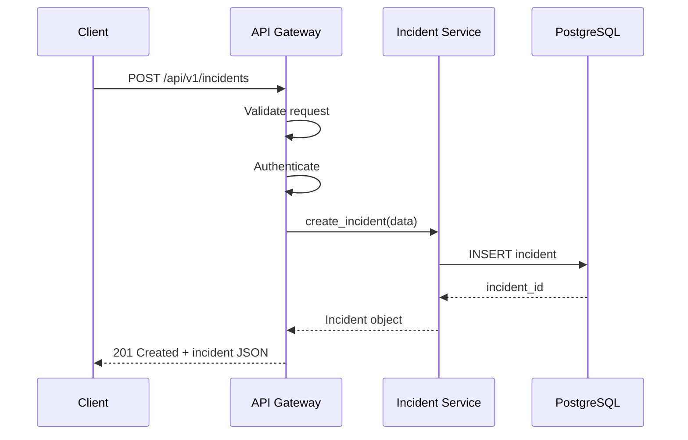
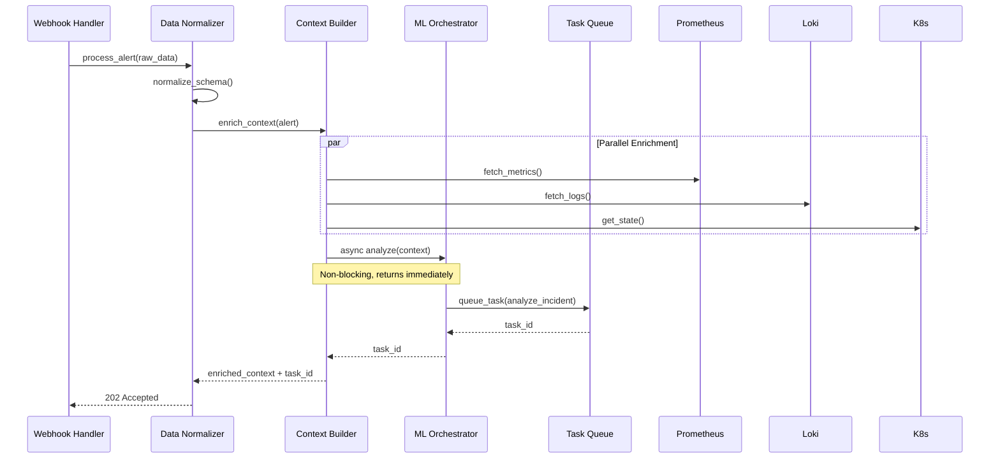
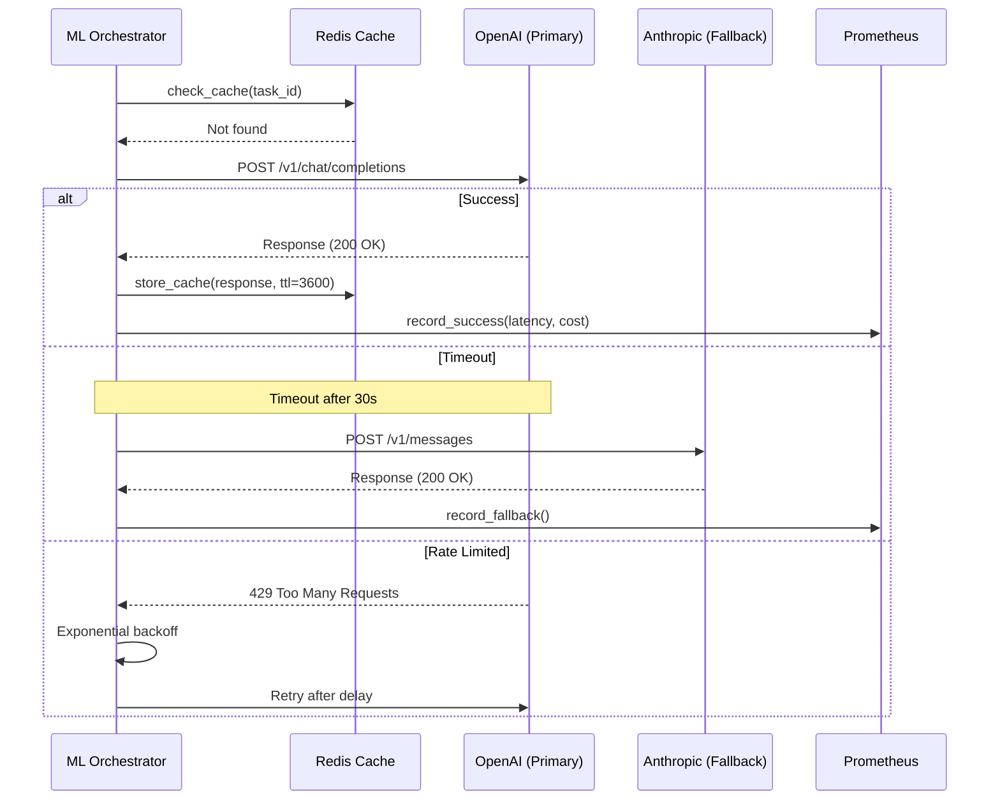
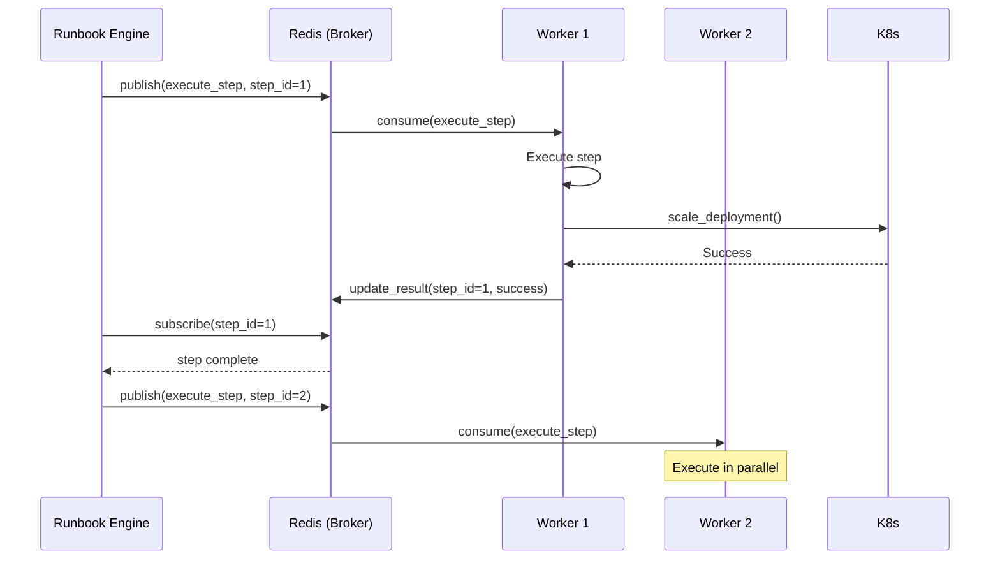
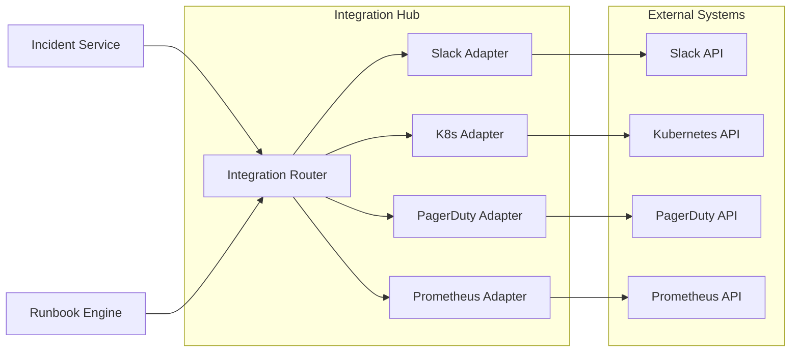
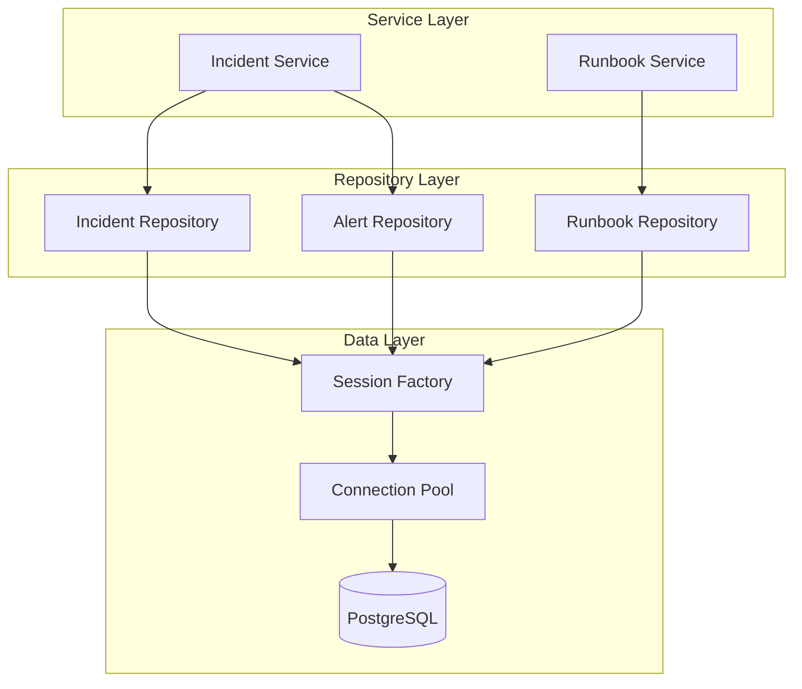

# Service Interaction Patterns

## Overview

This document describes how services within the incident response platform communicate, including protocols, data formats, error handling, and interaction patterns. The system follows a microservices-inspired architecture with clear boundaries and well-defined interfaces.

## Service Catalog

### Core Services

| Service | Purpose | Technology | Port |
|---------|---------|------------|------|
| API Gateway | External API and webhooks | FastAPI | 8000 |
| Incident Service | Incident lifecycle management | Python | Internal |
| ML Orchestrator | AI/ML model coordination | Python | Internal |
| Runbook Engine | Runbook execution | Celery + Python | Internal |
| Context Builder | Data aggregation | Python | Internal |
| Integration Hub | External system connectors | Python | Internal |

### External Dependencies

| Service | Purpose | Protocol |
|---------|---------|----------|
| PostgreSQL | Primary data store | TCP 5432 |
| Redis | Cache and queue | TCP 6379 |
| Vector DB (Qdrant) | RAG embeddings | HTTP 6333 |
| Prometheus | Metrics source & sink | HTTP 9090 |
| Loki | Log aggregation | HTTP 3100 |
| Grafana | Dashboards | HTTP 3000 |

## Communication Patterns

### 1. API Gateway → Internal Services (Synchronous)

**Pattern**: Request-Response via direct function calls



**Interface Example**:
```python
# src/routers/incidents.py
@router.post("/incidents", response_model=IncidentResponse)
async def create_incident(
    incident_data: IncidentCreate,
    incident_service: IncidentService = Depends(get_incident_service),
    current_user: User = Depends(get_current_user)
):
    """Create new incident"""
    incident = await incident_service.create_incident(
        title=incident_data.title,
        description=incident_data.description,
        severity=incident_data.severity,
        created_by=current_user.id
    )
    return incident
```

**Error Handling**:
- Service raises specific exceptions
- API Gateway catches and converts to HTTP responses
- Standard error format returned to client

```python
# Error response format
{
  "error": {
    "code": "INCIDENT_NOT_FOUND",
    "message": "Incident INC-2026-001 not found",
    "details": {},
    "timestamp": "2026-01-22T10:00:00Z"
  }
}
```

### 2. Webhook Ingestion → Context Builder (Async)

**Pattern**: Event-driven via async/await



**Implementation**:
```python
# Async enrichment
async def enrich_alert_context(alert: PrometheusAlert) -> MLContext:
    """Enrich alert with logs, metrics, K8s state"""
    
    # Parallel data gathering
    logs_task = fetch_logs_from_loki(alert)
    metrics_task = query_prometheus_metrics(alert)
    k8s_task = get_kubernetes_state(alert)
    historical_task = find_similar_incidents(alert)
    
    # Wait for all
    logs, metrics, k8s_state, similar = await asyncio.gather(
        logs_task,
        metrics_task,
        k8s_task,
        historical_task,
        return_exceptions=True  # Don't fail if one fails
    )
    
    return MLContext(
        alerts=[alert],
        logs=logs if not isinstance(logs, Exception) else None,
        metrics=metrics if not isinstance(metrics, Exception) else {},
        kubernetes_state=k8s_state if not isinstance(k8s_state, Exception) else None,
        similar_incidents=similar if not isinstance(similar, Exception) else []
    )
```

### 3. ML Orchestrator → Model Providers (External API)

**Pattern**: External API calls with retry and fallback



**Retry Logic**:
```python
class ModelProvider:
    async def generate_with_retry(
        self, 
        prompt: MLPrompt,
        max_retries: int = 3
    ) -> MLResponse:
        """Generate with exponential backoff retry"""
        
        for attempt in range(max_retries):
            try:
                async with timeout(30):  # 30s timeout
                    return await self.generate(prompt)
                    
            except TimeoutError:
                if attempt == max_retries - 1:
                    # Try fallback model
                    return await self._try_fallback(prompt)
                    
                wait_time = 2 ** attempt  # 1s, 2s, 4s
                await asyncio.sleep(wait_time)
                
            except RateLimitError as e:
                # Respect rate limit
                retry_after = int(e.headers.get("Retry-After", 60))
                await asyncio.sleep(retry_after)
                
            except Exception as e:
                logger.error(f"Model error: {e}")
                if attempt == max_retries - 1:
                    raise ModelGenerationError(f"All retries failed: {e}")
```

### 4. Runbook Engine → Celery Workers (Task Queue)

**Pattern**: Distributed task execution via message queue



**Task Definition**:
```python
# src/tasks/runbook_tasks.py
from celery import Celery

celery_app = Celery(
    "incident_response",
    broker="redis://localhost:6379/0",
    backend="redis://localhost:6379/1"
)

@celery_app.task(bind=True, max_retries=3)
def execute_runbook_step(
    self,
    step_id: str,
    step_config: Dict,
    context: Dict
) -> Dict:
    """Execute a single runbook step"""
    
    try:
        executor = get_step_executor(step_config["type"])
        result = executor.execute(step_config, context)
        
        return {
            "status": "success",
            "output": result,
            "duration": result.duration
        }
        
    except Exception as e:
        # Retry with exponential backoff
        raise self.retry(exc=e, countdown=2 ** self.request.retries)
```

**Engine monitors tasks**:
```python
class RunbookEngine:
    async def execute_runbook(
        self, 
        runbook: Runbook, 
        context: Dict
    ) -> RunbookExecution:
        """Execute runbook steps"""
        
        execution = RunbookExecution(
            runbook_id=runbook.id,
            status=ExecutionStatus.RUNNING
        )
        
        for step in runbook.steps:
            # Queue task
            task = execute_runbook_step.delay(
                step_id=step.id,
                step_config=step.dict(),
                context=context
            )
            
            # Wait for completion (with timeout)
            try:
                result = await asyncio.wait_for(
                    self._wait_for_task(task.id),
                    timeout=step.timeout_seconds
                )
                
                execution.step_results.append(result)
                
            except asyncio.TimeoutError:
                # Mark as failed, continue or abort based on config
                if not step.continue_on_failure:
                    await self._execute_rollback(runbook, execution)
                    break
        
        return execution
```

### 5. Integration Hub → External Systems

**Pattern**: Adapter pattern with unified interface



**Base Adapter Interface**:
```python
# src/services/integrations/base.py
from abc import ABC, abstractmethod

class BaseIntegration(ABC):
    """Base class for all integrations"""
    
    def __init__(self, config: IntegrationConfig):
        self.config = config
        self.client = self._initialize_client()
        
    @abstractmethod
    async def test_connection(self) -> bool:
        """Test if integration is working"""
        pass
    
    @abstractmethod
    async def send_notification(
        self, 
        message: str, 
        **kwargs
    ) -> NotificationResult:
        """Send notification to external system"""
        pass
    
    async def execute_with_circuit_breaker(
        self, 
        func: Callable,
        *args,
        **kwargs
    ):
        """Execute with circuit breaker pattern"""
        
        if not await self._check_circuit_breaker():
            raise CircuitBreakerOpenError(f"{self.config.name} circuit open")
        
        try:
            result = await func(*args, **kwargs)
            await self._record_success()
            return result
            
        except Exception as e:
            await self._record_failure()
            raise
```

**Slack Adapter Implementation**:
```python
# src/services/integrations/slack.py
from slack_sdk.web.async_client import AsyncWebClient

class SlackIntegration(BaseIntegration):
    """Slack integration adapter"""
    
    def _initialize_client(self):
        return AsyncWebClient(token=self.config.api_token)
    
    async def test_connection(self) -> bool:
        """Test Slack connection"""
        try:
            response = await self.client.auth_test()
            return response["ok"]
        except Exception:
            return False
    
    async def send_notification(
        self,
        message: str,
        channel: str = None,
        thread_ts: str = None,
        blocks: List[Dict] = None,
        **kwargs
    ) -> NotificationResult:
        """Send message to Slack"""
        
        channel = channel or self.config.default_channel
        
        return await self.execute_with_circuit_breaker(
            self._send_message,
            channel=channel,
            text=message,
            thread_ts=thread_ts,
            blocks=blocks
        )
    
    async def _send_message(
        self,
        channel: str,
        text: str,
        thread_ts: str = None,
        blocks: List[Dict] = None
    ) -> NotificationResult:
        """Internal send message"""
        
        response = await self.client.chat_postMessage(
            channel=channel,
            text=text,
            thread_ts=thread_ts,
            blocks=blocks
        )
        
        return NotificationResult(
            success=response["ok"],
            message_id=response["ts"],
            thread_id=response.get("thread_ts"),
            channel=channel
        )
    
    async def create_incident_thread(
        self,
        incident: Incident
    ) -> str:
        """Create dedicated thread for incident"""
        
        blocks = self._build_incident_blocks(incident)
        
        result = await self.send_notification(
            message=f"🚨 New Incident: {incident.title}",
            channel=self.config.incidents_channel,
            blocks=blocks
        )
        
        return result.thread_id
    
    async def request_approval(
        self,
        incident_id: str,
        runbook: Runbook,
        timeout_seconds: int = 900  # 15 minutes
    ) -> bool:
        """Request approval with interactive buttons"""
        
        blocks = [
            {
                "type": "section",
                "text": {
                    "type": "mrkdwn",
                    "text": f"*Approval Required*\n\nIncident: {incident_id}\nRunbook: {runbook.name}"
                }
            },
            {
                "type": "actions",
                "block_id": f"approval_{incident_id}",
                "elements": [
                    {
                        "type": "button",
                        "text": {"type": "plain_text", "text": "Approve"},
                        "style": "primary",
                        "value": "approve",
                        "action_id": "approve_runbook"
                    },
                    {
                        "type": "button",
                        "text": {"type": "plain_text", "text": "Reject"},
                        "style": "danger",
                        "value": "reject",
                        "action_id": "reject_runbook"
                    }
                ]
            }
        ]
        
        await self.send_notification(
            message="Approval required",
            blocks=blocks
        )
        
        # Wait for response (via webhook callback)
        return await self._wait_for_approval(incident_id, timeout_seconds)
```

**Kubernetes Adapter Implementation**:
```python
# src/services/integrations/kubernetes.py
from kubernetes import client, config
from kubernetes.client.rest import ApiException

class KubernetesIntegration(BaseIntegration):
    """Kubernetes integration adapter"""
    
    def _initialize_client(self):
        if self.config.in_cluster:
            config.load_incluster_config()
        else:
            config.load_kube_config(self.config.kubeconfig_path)
        
        return {
            "apps_v1": client.AppsV1Api(),
            "core_v1": client.CoreV1Api(),
            "batch_v1": client.BatchV1Api()
        }
    
    async def test_connection(self) -> bool:
        """Test K8s connection"""
        try:
            self.client["core_v1"].list_namespace(limit=1)
            return True
        except Exception:
            return False
    
    async def scale_deployment(
        self,
        namespace: str,
        deployment: str,
        replicas: int
    ) -> Dict:
        """Scale deployment"""
        
        return await self.execute_with_circuit_breaker(
            self._scale_deployment_impl,
            namespace=namespace,
            deployment=deployment,
            replicas=replicas
        )
    
    def _scale_deployment_impl(
        self,
        namespace: str,
        deployment: str,
        replicas: int
    ) -> Dict:
        """Internal scale implementation"""
        
        try:
            # Get current deployment
            api = self.client["apps_v1"]
            dep = api.read_namespaced_deployment(deployment, namespace)
            
            # Update replicas
            dep.spec.replicas = replicas
            
            # Patch deployment
            api.patch_namespaced_deployment_scale(
                name=deployment,
                namespace=namespace,
                body={"spec": {"replicas": replicas}}
            )
            
            return {
                "success": True,
                "previous_replicas": dep.spec.replicas,
                "new_replicas": replicas,
                "deployment": deployment,
                "namespace": namespace
            }
            
        except ApiException as e:
            raise IntegrationError(f"Failed to scale deployment: {e}")
    
    async def restart_pods(
        self,
        namespace: str,
        label_selector: str
    ) -> Dict:
        """Restart pods by deleting them"""
        
        api = self.client["core_v1"]
        
        # List pods
        pods = api.list_namespaced_pod(
            namespace=namespace,
            label_selector=label_selector
        )
        
        deleted = []
        for pod in pods.items:
            api.delete_namespaced_pod(
                name=pod.metadata.name,
                namespace=namespace
            )
            deleted.append(pod.metadata.name)
        
        return {
            "success": True,
            "deleted_pods": deleted,
            "count": len(deleted)
        }
    
    async def get_pod_logs(
        self,
        namespace: str,
        pod: str,
        container: str = None,
        tail_lines: int = 100
    ) -> str:
        """Get pod logs"""
        
        api = self.client["core_v1"]
        
        logs = api.read_namespaced_pod_log(
            name=pod,
            namespace=namespace,
            container=container,
            tail_lines=tail_lines
        )
        
        return logs
```

### 6. Database Access Pattern

**Pattern**: Repository pattern with connection pooling



**Session Management**:
```python
# src/utils/database.py
from sqlalchemy.ext.asyncio import create_async_engine, AsyncSession
from sqlalchemy.orm import sessionmaker
from contextlib import asynccontextmanager

# Create engine with connection pooling
engine = create_async_engine(
    settings.database_url,
    echo=settings.debug,
    pool_size=20,  # Connection pool size
    max_overflow=10,  # Additional connections
    pool_pre_ping=True,  # Verify connections before use
    pool_recycle=3600  # Recycle connections after 1 hour
)

# Session factory
async_session_factory = sessionmaker(
    engine,
    class_=AsyncSession,
    expire_on_commit=False
)

@asynccontextmanager
async def get_db_session():
    """Get database session with automatic cleanup"""
    session = async_session_factory()
    try:
        yield session
        await session.commit()
    except Exception:
        await session.rollback()
        raise
    finally:
        await session.close()

# Dependency for FastAPI
async def get_db():
    async with get_db_session() as session:
        yield session
```

**Repository Pattern**:
```python
# src/repositories/incident_repository.py
class IncidentRepository:
    """Data access layer for incidents"""
    
    def __init__(self, session: AsyncSession):
        self.session = session
    
    async def create(self, incident: Incident) -> Incident:
        """Create new incident"""
        self.session.add(incident)
        await self.session.flush()  # Get ID without committing
        return incident
    
    async def get_by_id(self, incident_id: str) -> Optional[Incident]:
        """Get incident by ID"""
        result = await self.session.execute(
            select(Incident).where(Incident.id == incident_id)
        )
        return result.scalar_one_or_none()
    
    async def list_active(
        self,
        limit: int = 50,
        offset: int = 0
    ) -> List[Incident]:
        """List active incidents"""
        result = await self.session.execute(
            select(Incident)
            .where(Incident.status.in_([
                IncidentStatus.NEW,
                IncidentStatus.INVESTIGATING,
                IncidentStatus.MONITORING
            ]))
            .order_by(Incident.created_at.desc())
            .limit(limit)
            .offset(offset)
        )
        return result.scalars().all()
    
    async def update_status(
        self,
        incident_id: str,
        new_status: IncidentStatus
    ) -> Incident:
        """Update incident status"""
        incident = await self.get_by_id(incident_id)
        if not incident:
            raise IncidentNotFoundError(incident_id)
        
        incident.status = new_status
        incident.updated_at = datetime.utcnow()
        
        if new_status == IncidentStatus.RESOLVED:
            incident.resolved_at = datetime.utcnow()
            incident.time_to_resolve_seconds = (
                incident.resolved_at - incident.created_at
            ).total_seconds()
        
        await self.session.flush()
        return incident
```

## Error Handling Patterns

### 1. Graceful Degradation

Services should degrade gracefully when dependencies fail:

```python
async def enrich_context(alert: PrometheusAlert) -> MLContext:
    """Enrich with best-effort data gathering"""
    
    context = MLContext(
        task=MLTaskType.CLASSIFICATION,
        alerts=[alert],
        timestamp=datetime.utcnow()
    )
    
    # Try to fetch logs (non-critical)
    try:
        context.logs = await fetch_logs_from_loki(alert)
    except Exception as e:
        logger.warning(f"Failed to fetch logs: {e}")
        # Continue without logs
    
    # Try to fetch metrics (non-critical)
    try:
        context.metrics = await query_prometheus(alert)
    except Exception as e:
        logger.warning(f"Failed to fetch metrics: {e}")
        # Continue without metrics
    
    # K8s state is critical - fail if unavailable
    try:
        context.kubernetes_state = await get_k8s_state(alert)
    except Exception as e:
        logger.error(f"Failed to get K8s state: {e}")
        raise CriticalDependencyError("Kubernetes state required")
    
    return context
```

### 2. Circuit Breaker

Prevent cascading failures:

```python
class CircuitBreaker:
    """Circuit breaker for external dependencies"""
    
    def __init__(
        self,
        failure_threshold: int = 5,
        recovery_timeout: int = 60,
        expected_exception: Type[Exception] = Exception
    ):
        self.failure_threshold = failure_threshold
        self.recovery_timeout = recovery_timeout
        self.expected_exception = expected_exception
        
        self.failure_count = 0
        self.last_failure_time = None
        self.state = "closed"  # closed, open, half-open
    
    async def call(self, func: Callable, *args, **kwargs):
        """Execute function with circuit breaker"""
        
        if self.state == "open":
            if self._should_attempt_reset():
                self.state = "half-open"
            else:
                raise CircuitBreakerOpenError("Circuit breaker is open")
        
        try:
            result = await func(*args, **kwargs)
            self._on_success()
            return result
            
        except self.expected_exception as e:
            self._on_failure()
            raise
    
    def _on_success(self):
        """Reset on success"""
        self.failure_count = 0
        self.state = "closed"
    
    def _on_failure(self):
        """Increment failures, open if threshold reached"""
        self.failure_count += 1
        self.last_failure_time = time.time()
        
        if self.failure_count >= self.failure_threshold:
            self.state = "open"
    
    def _should_attempt_reset(self) -> bool:
        """Check if enough time has passed to try again"""
        return (
            time.time() - self.last_failure_time >= self.recovery_timeout
        )
```

## Service Discovery & Configuration

### Configuration Management

All service connections configured via environment variables:

```python
# src/config.py
from pydantic_settings import BaseSettings

class Settings(BaseSettings):
    # API
    api_host: str = "0.0.0.0"
    api_port: int = 8000
    
    # Database
    database_url: str
    database_pool_size: int = 20
    
    # Redis
    redis_url: str = "redis://localhost:6379/0"
    
    # Celery
    celery_broker_url: str = "redis://localhost:6379/0"
    celery_result_backend: str = "redis://localhost:6379/1"
    
    # External integrations
    prometheus_url: str = "http://prometheus:9090"
    loki_url: str = "http://loki:3100"
    grafana_url: str = "http://grafana:3000"
    
    # ML providers
    openai_api_key: str
    anthropic_api_key: str
    
    # Slack
    slack_bot_token: str
    slack_incidents_channel: str = "#incidents"
    
    # Kubernetes
    k8s_in_cluster: bool = True
    k8s_kubeconfig_path: str = "~/.kube/config"
    
    class Config:
        env_file = ".env"
        case_sensitive = False

settings = Settings()
```

## Monitoring Service Interactions

### Distributed Tracing

Use OpenTelemetry for request tracing:

```python
from opentelemetry import trace
from opentelemetry.instrumentation.fastapi import FastAPIInstrumentor

tracer = trace.get_tracer(__name__)

@router.post("/webhooks/prometheus")
async def prometheus_webhook(alert: PrometheusAlert):
    with tracer.start_as_current_span("process_prometheus_alert") as span:
        span.set_attribute("alert.name", alert.alert_name)
        span.set_attribute("alert.severity", alert.labels.get("severity"))
        
        # Process alert with tracing
        with tracer.start_as_current_span("enrich_context"):
            context = await enrich_context(alert)
        
        with tracer.start_as_current_span("ml_analysis"):
            insights = await ml_orchestrator.analyze(context)
        
        with tracer.start_as_current_span("create_incident"):
            incident = await incident_service.create(insights)
        
        return {"incident_id": incident.id}
```

### Service Health Checks

Each service exposes health endpoint:

```python
@router.get("/health")
async def health_check():
    """Health check endpoint"""
    
    health_status = {
        "status": "healthy",
        "timestamp": datetime.utcnow().isoformat(),
        "dependencies": {}
    }
    
    # Check database
    try:
        await db.execute("SELECT 1")
        health_status["dependencies"]["database"] = "healthy"
    except Exception as e:
        health_status["dependencies"]["database"] = f"unhealthy: {e}"
        health_status["status"] = "degraded"
    
    # Check Redis
    try:
        await redis.ping()
        health_status["dependencies"]["redis"] = "healthy"
    except Exception as e:
        health_status["dependencies"]["redis"] = f"unhealthy: {e}"
        health_status["status"] = "degraded"
    
    # Check ML providers
    for provider in ml_registry.list_providers():
        try:
            await provider.health_check()
            health_status["dependencies"][provider.name] = "healthy"
        except Exception as e:
            health_status["dependencies"][provider.name] = f"unhealthy: {e}"
    
    status_code = 200 if health_status["status"] == "healthy" else 503
    return JSONResponse(health_status, status_code=status_code)
```

## Conclusion

The service interaction patterns emphasize:
- **Asynchronous communication** where possible for better performance
- **Fault tolerance** through retry logic, circuit breakers, and graceful degradation
- **Observability** via tracing, logging, and health checks
- **Clean interfaces** using adapters and repositories
- **Scalability** through connection pooling and distributed task execution

These patterns ensure the system remains responsive and reliable even under failure conditions.
