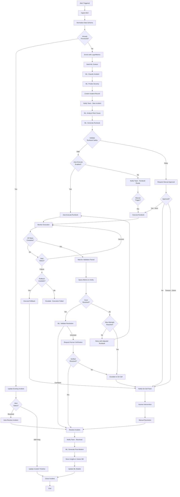
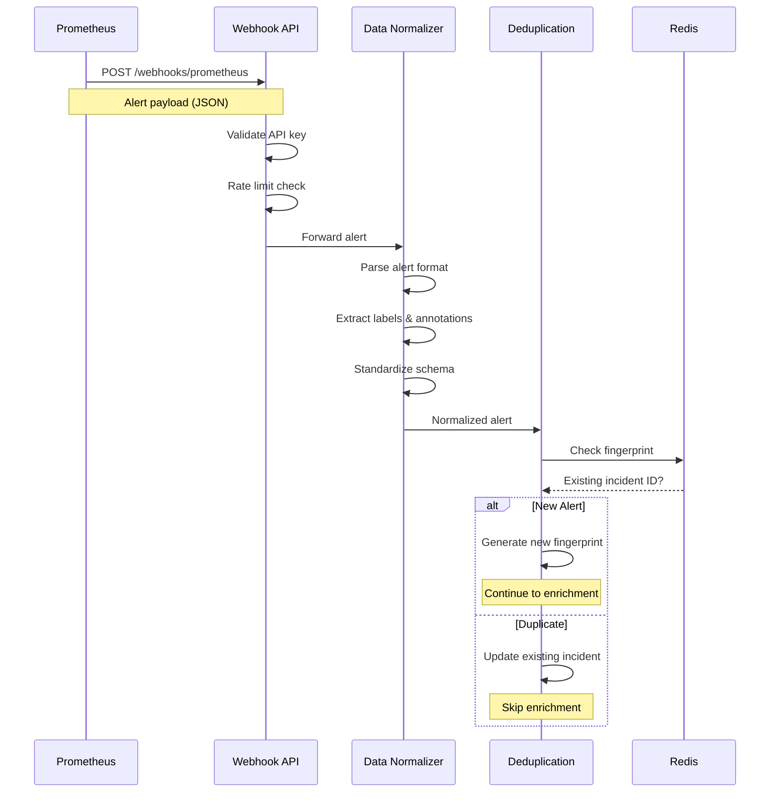
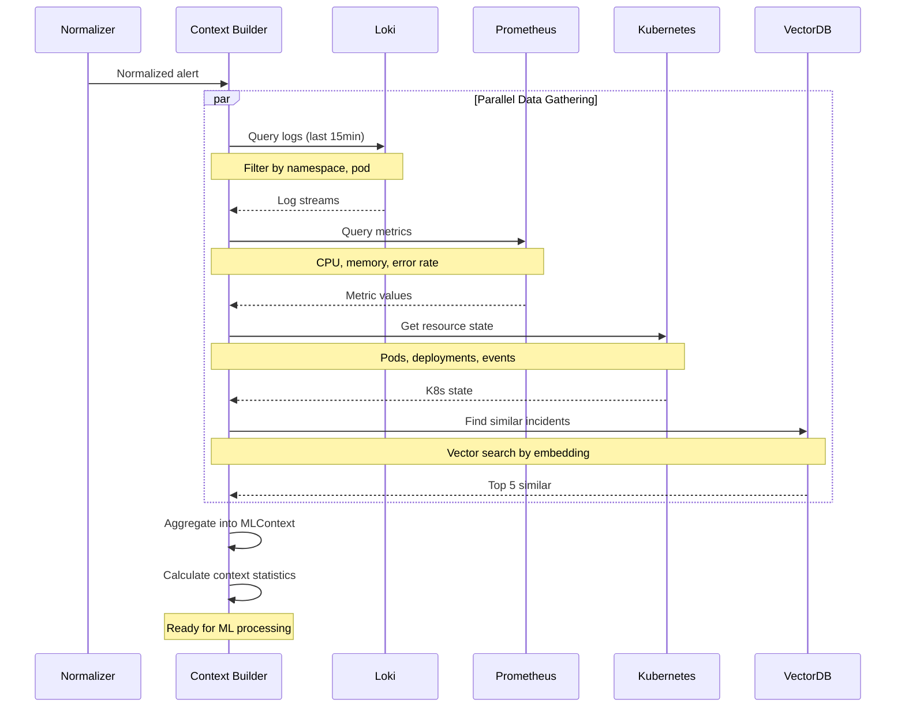
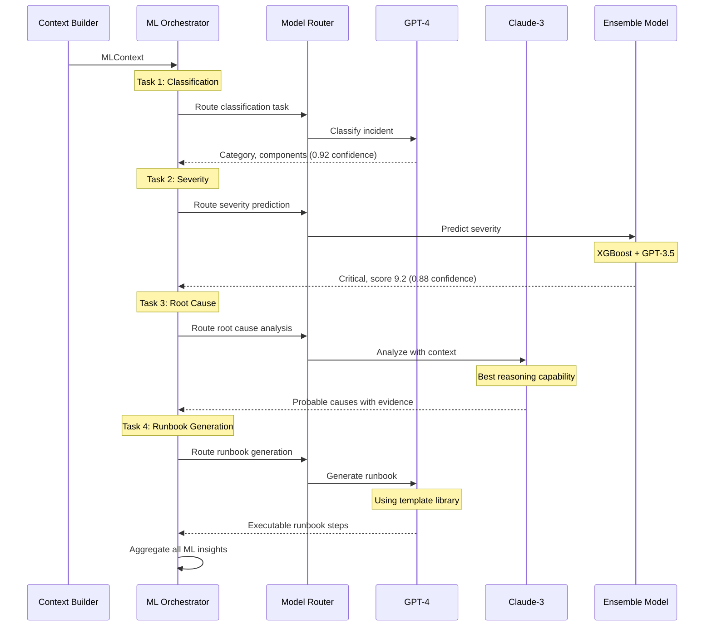
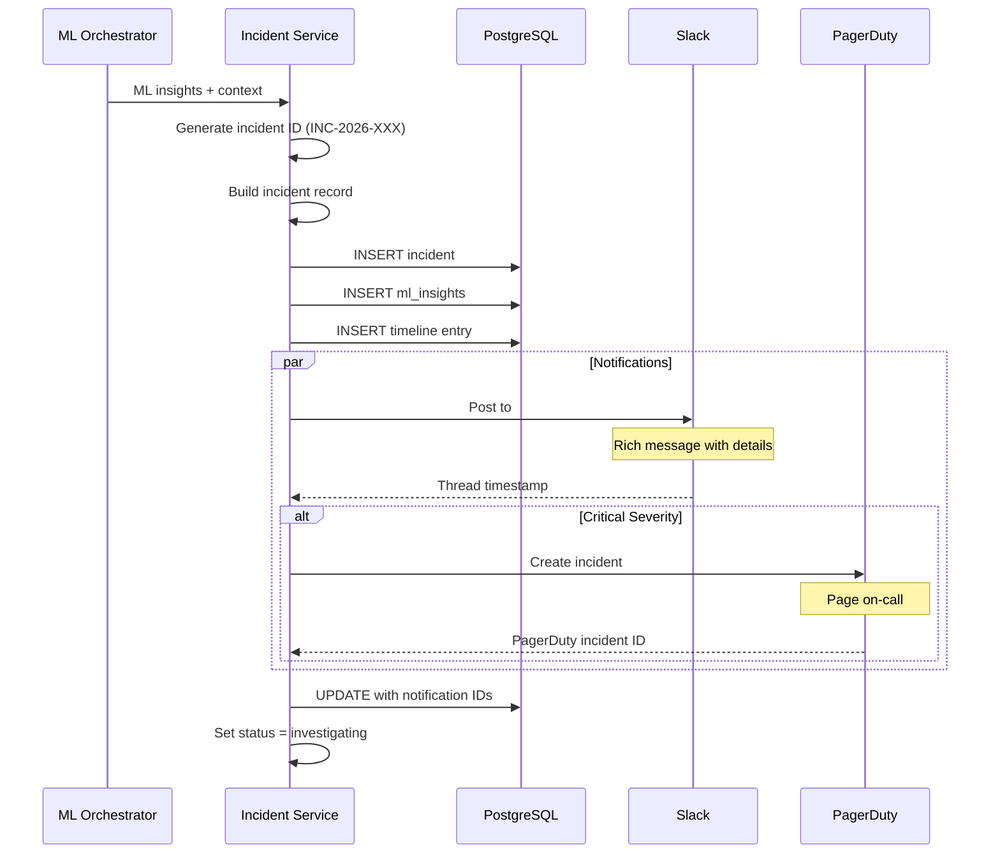
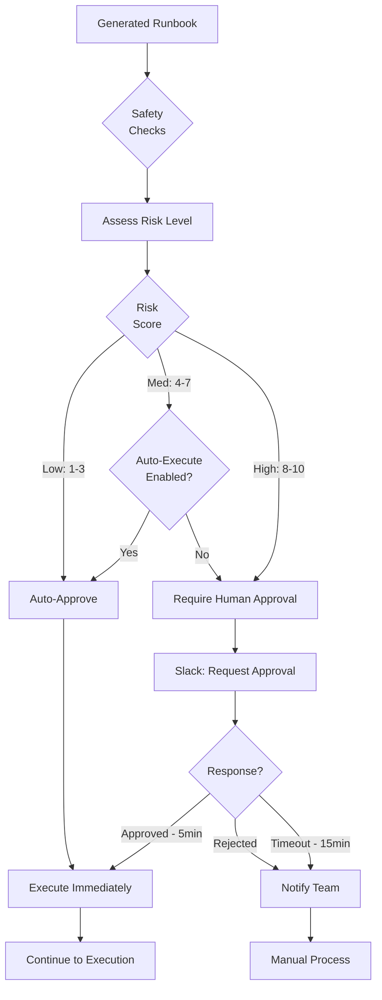
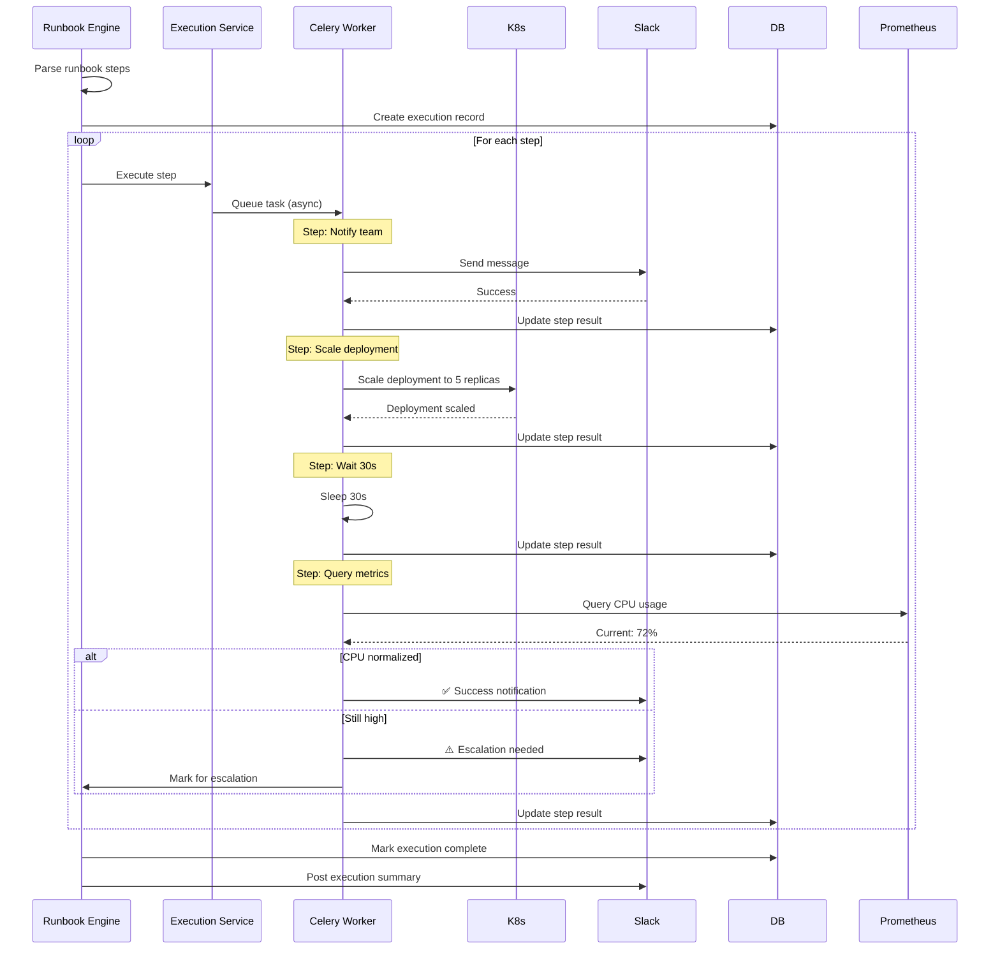
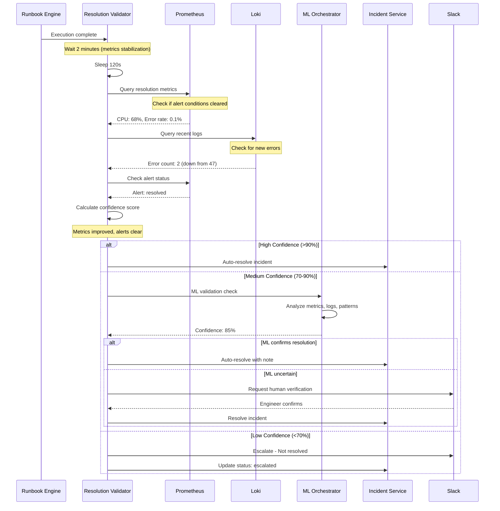
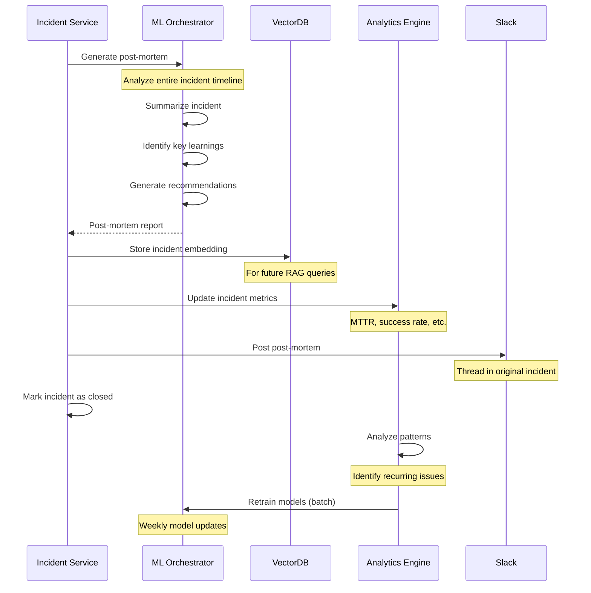

# End-to-End System Flow

## Overview

This document describes the complete incident lifecycle from detection through resolution, including all system interactions, decision points, and data flows. The platform automates as much as possible while maintaining safety through validation and human oversight for high-risk operations.

## Complete Incident Lifecycle



## Phase-by-Phase Breakdown

### Phase 1: Detection & Ingestion (0-10 seconds)

**Trigger**: Prometheus/AlertManager sends webhook



**Key Operations**:
1. **Authentication**: Verify API key from webhook source
2. **Rate Limiting**: Prevent flood (100 alerts/min per source)
3. **Parsing**: Convert alert format to internal schema
4. **Fingerprinting**: Generate unique ID based on alert labels
5. **Deduplication**: Check if this alert is already being handled

**Deduplication Logic**:
```python
def generate_fingerprint(alert: PrometheusAlert) -> str:
    """Generate fingerprint for deduplication"""
    # Use alertname + key labels
    key_labels = ["alertname", "namespace", "pod", "service"]
    parts = [alert.alert_name]
    for label in key_labels:
        if label in alert.labels:
            parts.append(f"{label}={alert.labels[label]}")
    
    return hashlib.sha256(":".join(parts).encode()).hexdigest()[:16]
```

### Phase 2: Context Enrichment (10-30 seconds)

**Goal**: Gather all relevant data for ML analysis



**Data Collection Details**:

| Data Source | Query | Time Window | Purpose |
|-------------|-------|-------------|---------|
| Loki | `{namespace="X",pod=~"Y.*"} | level="ERROR"` | Last 15 min | Error context |
| Prometheus | Pod CPU, memory, request rate | Last 30 min | Resource state |
| Kubernetes | Pod status, events, deployments | Current | Infrastructure |
| Vector DB | Embedding similarity search | Historical | Past incidents |

**Context Statistics**:
- Total log entries: 1,250
- Error count: 47
- Warning count: 128
- Failed pods: 1/5
- Similar incidents found: 3

### Phase 3: ML Analysis (30 seconds - 2 minutes)

**Goal**: Use ML to understand and classify the incident



**ML Task Timing**:
- Classification: 3-5 seconds
- Severity Prediction: 2-3 seconds (ensemble)
- Root Cause Analysis: 10-15 seconds (most complex)
- Runbook Generation: 8-12 seconds

**Total ML Time**: ~30-40 seconds

**Output Example**:
```json
{
  "classification": {
    "category": "infrastructure",
    "subcategory": "compute",
    "affected_components": ["api-gateway", "database-connection-pool"],
    "confidence": 0.92
  },
  "severity": {
    "level": "critical",
    "score": 9.2,
    "confidence": 0.88
  },
  "root_cause": {
    "primary": "Database connection pool exhaustion",
    "confidence": 0.85,
    "evidence": ["Timeout errors", "Pool at max capacity"]
  },
  "runbook": {
    "id": "generated-rb-001",
    "steps": 7,
    "estimated_duration": "5-10 minutes",
    "risk_level": "medium"
  }
}
```

### Phase 4: Incident Creation (2-3 minutes)

**Goal**: Create incident record and notify team



**Slack Notification Format**:
```
🚨 New Critical Incident: INC-2026-001

Title: High CPU usage on API Gateway
Severity: 🔴 Critical (9.2/10)
Category: Infrastructure > Compute

Affected: api-gateway (production)
Started: 2026-01-22 10:00:00 UTC

ML Analysis:
✓ Classified (92% confidence)
✓ Root Cause: Database connection pool exhaustion (85% confidence)

Evidence:
• Connection timeout errors (47 occurrences)
• DB pool at maximum capacity (100/100)
• Similar to INC-2026-042 (87% match)

🤖 Auto-Response: Runbook generated (7 steps, ~5-10min)
Status: Validating safety...

[View Details] [Approve Runbook] [Escalate]
```

### Phase 5: Runbook Validation & Approval (3-5 minutes)

**Goal**: Ensure runbook is safe to execute



**Risk Assessment Criteria**:

| Operation | Base Risk | Conditions | Final Risk |
|-----------|-----------|------------|-----------|
| Query metrics/logs | 1 | None | LOW (1) |
| Send notification | 1 | None | LOW (1) |
| Scale deployment up | 3 | Prod + business hours | MEDIUM (5) |
| Scale deployment down | 5 | Prod + business hours | MEDIUM (7) |
| Restart pods | 5 | >50% of replicas | HIGH (8) |
| Delete resources | 10 | Any | HIGH (10) |
| Run custom script | 7 | Prod environment | HIGH (9) |
| Database operations | 8 | Prod database | HIGH (10) |

**Risk Calculation**:
```python
def calculate_runbook_risk(runbook: Runbook, context: MLContext) -> int:
    """Calculate overall risk score (1-10)"""
    max_step_risk = max(step.risk_level for step in runbook.steps)
    
    # Modifiers
    if context.environment == "production":
        max_step_risk += 2
    
    if context.labels.get("criticality") == "high":
        max_step_risk += 1
    
    if is_business_hours():
        max_step_risk += 1
    
    return min(max_step_risk, 10)
```

**Approval Flow**:
- Risk ≤ 3: **Auto-execute** immediately
- Risk 4-7: **Conditional** (check config)
- Risk ≥ 8: **Always require** human approval

### Phase 6: Runbook Execution (3-10 minutes)

**Goal**: Execute response steps with monitoring



**Step Execution with Error Handling**:
```python
async def execute_step(step: RunbookStep, context: Dict) -> StepResult:
    """Execute single runbook step with retry logic"""
    
    for attempt in range(1, step.retry_count + 1):
        try:
            # Execute with timeout
            result = await asyncio.wait_for(
                _execute_step_action(step, context),
                timeout=step.timeout_seconds
            )
            
            return StepResult(
                step_id=step.id,
                status=ExecutionStatus.SUCCESS,
                output=result,
                attempt=attempt
            )
            
        except TimeoutError:
            if attempt == step.retry_count:
                return StepResult(
                    step_id=step.id,
                    status=ExecutionStatus.FAILED,
                    error="Execution timeout",
                    attempt=attempt
                )
            
            await asyncio.sleep(step.retry_delay_seconds)
            
        except Exception as e:
            if step.continue_on_failure:
                return StepResult(
                    step_id=step.id,
                    status=ExecutionStatus.FAILED,
                    error=str(e),
                    attempt=attempt
                )
            else:
                # Execute rollback
                await execute_rollback(step, context)
                raise
```

**Real-time Status Updates** (via Slack):
```
⏳ Executing runbook for INC-2026-001...

Step 1/7: Notify team ✅ (2s)
Step 2/7: Scale api-gateway deployment ✅ (15s)
Step 3/7: Wait for pods to stabilize ⏱️ (30s)
Step 4/7: Query CPU metrics...
```

### Phase 7: Validation & Verification (10-15 minutes)

**Goal**: Verify the incident is truly resolved



**Resolution Confidence Calculation**:
```python
def calculate_resolution_confidence(
    before: MetricsSnapshot,
    after: MetricsSnapshot,
    alert_status: str
) -> float:
    """Calculate confidence that incident is resolved"""
    
    confidence = 0.0
    
    # Alert status (40% weight)
    if alert_status == "resolved":
        confidence += 0.4
    elif alert_status == "pending":
        confidence += 0.2
    
    # Metrics improvement (40% weight)
    if after.error_rate < before.error_rate * 0.1:  # 90% reduction
        confidence += 0.4
    elif after.error_rate < before.error_rate * 0.5:  # 50% reduction
        confidence += 0.2
    
    # No new errors in logs (20% weight)
    if after.log_errors < 5:  # Less than 5 errors in 5 min
        confidence += 0.2
    elif after.log_errors < 10:
        confidence += 0.1
    
    return confidence
```

### Phase 8: Post-Incident Learning (Post-resolution)

**Goal**: Learn from incident to improve future responses



**Post-Mortem Report Example**:
```markdown
# Post-Mortem: INC-2026-001

## Summary
High CPU usage on API Gateway pods caused by database connection pool exhaustion.

## Timeline
- 10:00:00 - Alert triggered (CPU > 90%)
- 10:00:45 - Incident created, ML analysis complete
- 10:02:00 - Runbook approved and started
- 10:05:30 - Runbook execution complete
- 10:08:00 - Verified resolution
- 10:08:15 - Incident resolved

**Total Duration**: 8 minutes 15 seconds

## Root Cause
Database connection pool configured with max 100 connections. Application code not properly closing connections, leading to pool exhaustion and cascading timeouts.

## Resolution
1. Scaled API Gateway from 3 to 5 replicas (immediate relief)
2. Restarted pods to reset connection pools
3. Verified metrics normalized

## Similar Incidents
- INC-2026-042 (87% similar) - Same root cause, resolved by code fix
- INC-2025-891 (72% similar) - Connection leak, resolved by restart

## Recommendations
1. **Immediate**: Review application code for connection leak
2. **Short-term**: Increase connection pool limit to 200
3. **Long-term**: Implement connection pool monitoring alerts
4. **Long-term**: Add automatic connection leak detection

## Metrics
- MTTR: 8min 15s (Target: <15min) ✅
- Auto-resolution: Yes
- Runbook effectiveness: 100%
- ML confidence: 85%

## Action Items
- [ ] Review DB connection handling in API code (@backend-team)
- [ ] Update connection pool configuration (@infra-team)
- [ ] Add monitoring for connection pool usage (@sre-team)
```

## Special Scenarios

### Scenario 1: Recurring Alert

If the same alert fires multiple times:
1. Update existing incident (don't create new)
2. Increment occurrence count
3. Increase severity if occurring frequently
4. ML analyzes pattern: Is previous fix working?

### Scenario 2: Alert Auto-Resolves

If alert resolves before runbook execution:
1. Cancel pending runbook
2. Auto-resolve incident
3. Record as "self-healing"
4. Still generate post-mortem for learning

### Scenario 3: Runbook Execution Fails

If runbook execution fails:
1. Attempt rollback steps
2. Escalate to on-call immediately
3. Provide full context and error details
4. Mark runbook as failed for analysis

### Scenario 4: Multiple Related Alerts

If multiple related alerts fire:
1. Group into single incident
2. Correlate by common labels
3. ML analyzes relationship
4. Generate combined runbook

## Performance Targets

| Phase | Target Time | Acceptable Range |
|-------|-------------|------------------|
| Detection → Ingestion | <5s | 2-10s |
| Context Enrichment | <20s | 10-30s |
| ML Analysis | <40s | 30-120s |
| Incident Creation | <5s | 2-10s |
| Runbook Execution | 5-10min | 3-15min |
| Validation | 2-5min | 1-10min |
| **Total MTTR** | **<15min** | **5-30min** |

## Monitoring the Flow

Every phase is monitored with:
- **Duration metrics**: How long each phase takes
- **Success rates**: % of incidents successfully auto-resolved
- **Error tracking**: Where failures occur most
- **Cost tracking**: ML API costs per incident

## Conclusion

This end-to-end flow enables rapid, intelligent incident response with minimal human intervention. The ML-powered analysis ensures accurate root cause identification, while safety checks prevent harmful automated actions. The learning loop continuously improves the system's effectiveness over time.
